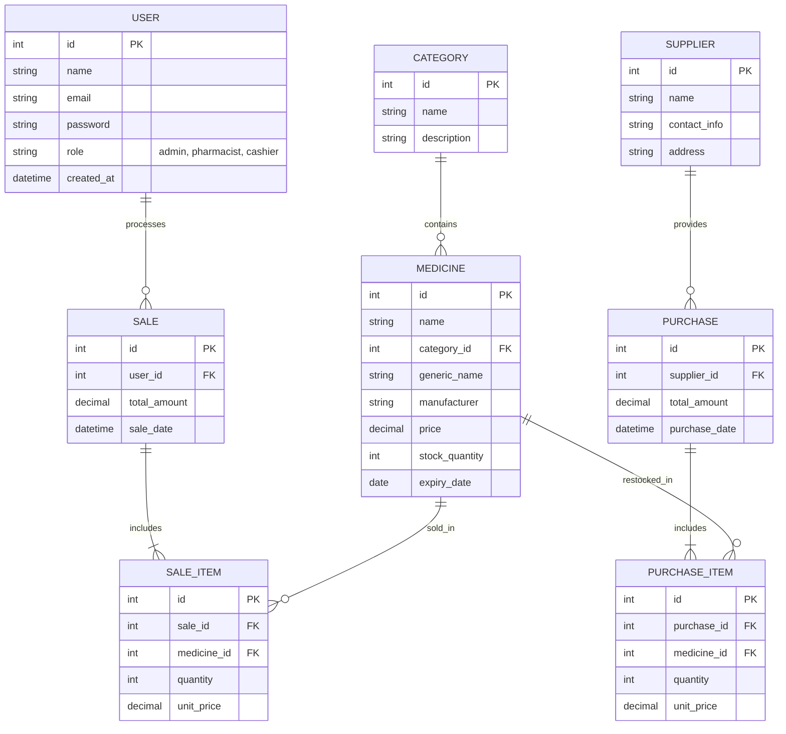

# Pharmacy Management System Entity-Relationship Diagram

```mermaid
erDiagram
    USER ||--o{ SALE : processes
    CATEGORY ||--o{ MEDICINE : contains
    SUPPLIER ||--o{ PURCHASE : provides
    PURCHASE ||--|{ PURCHASE_ITEM : includes
    MEDICINE ||--o{ PURCHASE_ITEM : restocked_in
    SALE ||--|{ SALE_ITEM : includes
    MEDICINE ||--o{ SALE_ITEM : sold_in

    USER {
        int id PK
        string name
        string email
        string password
        string role "admin, pharmacist, cashier"
        datetime created_at
    }
    CATEGORY {
        int id PK
        string name
        string description
    }
    MEDICINE {
        int id PK
        string name
        int category_id FK
        string generic_name
        string manufacturer
        decimal price
        int stock_quantity
        date expiry_date
    }
    SUPPLIER {
        int id PK
        string name
        string contact_info
        string address
    }
    PURCHASE {
        int id PK
        int supplier_id FK
        decimal total_amount
        datetime purchase_date
    }
    PURCHASE_ITEM {
        int id PK
        int purchase_id FK
        int medicine_id FK
        int quantity
        decimal unit_price
    }
    SALE {
        int id PK
        int user_id FK
        decimal total_amount
        datetime sale_date
    }
    SALE_ITEM {
        int id PK
        int sale_id FK
        int medicine_id FK
        int quantity
        decimal unit_price
    }
```
